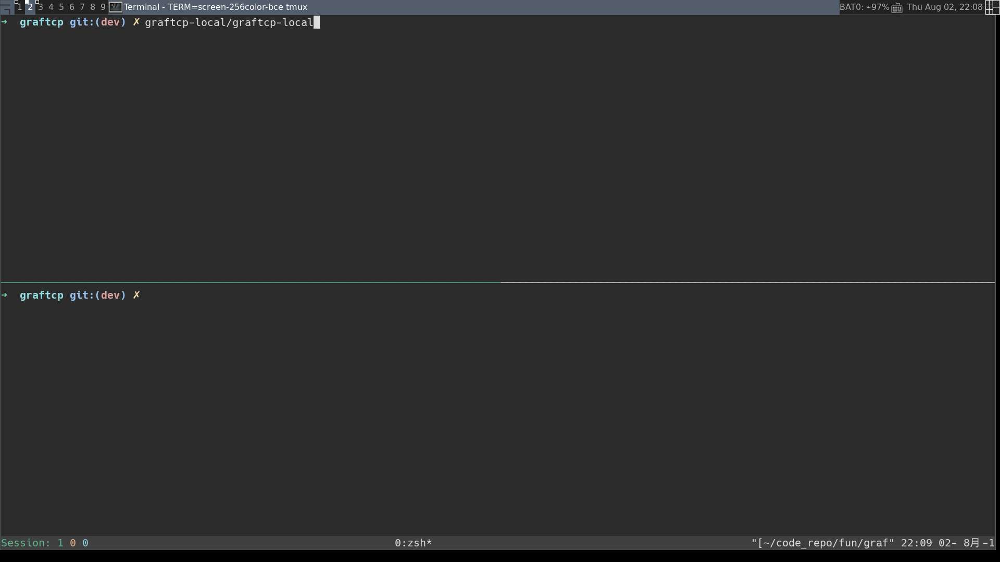

<!--
# GRAFTCP

`graftcp` is a proxy tool inspiring by [maybe](https://github.com/p-e-w/maybe) and [proxychains](https://github.com/haad/proxychains).
It hooks `connect(2)` function via `ptrace(2)` and redirects the connection through SOCKS5 proxies.
-->

# graftcp

**English** | [简体中文](./README.zh-CN.md)

## Introduction

`graftcp` can redirect the TCP connection made by the given program \[application, script, shell, etc.\] to SOCKS5 or HTTP proxy.

Compared with [tsocks](https://linux.die.net/man/8/tsocks), [proxychains](http://proxychains.sourceforge.net/) or [proxychains-ng](https://github.com/rofl0r/proxychains-ng), `graftcp` is not using the [LD_PRELOAD trick](https://stackoverflow.com/questions/426230/what-is-the-ld-preload-trick) which only work for dynamically linked programs, e.g., [applications built by Go can not be hook by proxychains-ng](https://github.com/rofl0r/proxychains-ng/issues/199). `graftcp` can trace or modify any
given program's connect by [`ptrace(2)`](https://en.wikipedia.org/wiki/Ptrace), so it is workable for any program. The principle will be explained in this paragraph of [how does it work](#principles).

## Installation

### Install from source

`graftcp` runs on Linux. Building `graftcp-local` requires [Go](https://golang.org/doc/install) installed.

```sh
git clone https://github.com/hmgle/graftcp.git
cd graftcp
make
```

After make finishes, you'll be able to use `local/graftcp-local` and `./graftcp`.
Optionally, you can also install them to system:

```sh
sudo make install
# Install systemed unit
sudo make install_systemd
# Activate systemd service
sudo make enable_systemd
```

### Install from binary package

Download the [Debian](https://github.com/hmgle/graftcp/releases/download/v0.4.0/graftcp_0.4.0-1_amd64.deb) or [Arch Linux](https://github.com/hmgle/graftcp/releases/download/v0.4.0/graftcp-0.4.0-1-x86_64.pkg.tar.zst) package from https://github.com/hmgle/graftcp/releases and install.

## Usage

`graftcp-local`:

```console
$ local/graftcp-local -h
Usage of local/graftcp-local:
  -config string
        Path to the configuration file
  -http_proxy string
        http proxy address, e.g.: 127.0.0.1:8080
  -listen string
        Listen address (default ":2233")
  -logfile string
        Write logs to file
  -loglevel value
        Log level (0-6) (default 1)
  -pipepath string
        Pipe path for graftcp to send address info (default "/tmp/graftcplocal.fifo")
  -select_proxy_mode string
        Set the mode for select a proxy [auto | random | only_http_proxy | only_socks5] (default "auto")
  -service string
        Control the system service: ["start" "stop" "restart" "install" "uninstall"]
  -socks5 string
        SOCKS5 address (default "127.0.0.1:1080")
  -syslog
        Send logs to the local system logger (Eventlog on Windows, syslog on Unix)
```

`graftcp`:

```console
$ graftcp -h
Usage: graftcp [options] prog [prog-args]

Options:
  -c --conf-file=<config-file-path>
                    Specify configuration file.
                    Default: $XDG_CONFIG_HOME/graftcp/graftcp.conf
  -a --local-addr=<graftcp-local-IP-addr>
                    graftcp-local's IP address. Default: localhost
  -p --local-port=<graftcp-local-port>
                    Which port is graftcp-local listening? Default: 2233
  -f --local-fifo=<fifo-path>
                    Path of fifo to communicate with graftcp-local.
                    Default: /tmp/graftcplocal.fifo
  -b --blackip-file=<black-ip-file-path>
                    The IP/CIDR in black-ip-file will connect direct
  -w --whiteip-file=<white-ip-file-path>
                    Only redirect the connect that destination IP/CIDR in
                    the white-ip-file to SOCKS5
  -n --not-ignore-local
                    Connecting to local is not changed by default, this
                    option will redirect it to SOCKS5
  -u --user=<username>
                    Run command as USERNAME handling setuid and/or setgid
  -V --version
                    Show version
  -h --help
                    Display this help and exit
```

`mgraftcp`: Combined `graftcp-local` and `graftcp` (`mgraftcp` = `graftcp-local` + `graftcp`).
`mgraftcp` can be used to replace `graftcp` without running `graftcp-local`.

```console
Usage: mgraftcp [-hn] [-b value] [--enable-debug-log] [--http_proxy value] [--select_proxy_mode value] \
    [--socks5 value] [--socks5_password value] [--socks5_username value] [--version] [-w value] prog [prog-args]
 -b, --blackip-file=value
                The IP/CIDR in black-ip-file will connect direct
     --enable-debug-log
                enable debug log
 -h, --help     Display this help and exit
     --http_proxy=value
                http proxy address, e.g.: 127.0.0.1:8080
 -n, --not-ignore-local
                Connecting to local is not changed by default, this option
                will redirect it to SOCKS5
     --select_proxy_mode=value
                Set the mode for select a proxy [auto | random |
                only_http_proxy | only_socks5 | direct] [auto]
     --socks5=value
                SOCKS5 address [127.0.0.1:1080]
     --socks5_password=value
                SOCKS5 password
     --socks5_username=value
                SOCKS5 username
 -u, --username=value
                Run command as USERNAME handling setuid and/or setgid
     --version  Print the mgraftcp version information
 -w, --whiteip-file=value
                Only redirect the connect that destination IP/CIDR in the
                white-ip-file to SOCKS5
```

### Configuration

`graftcp-local` and `mgraftcp` look for config file in following order:

1. File provided as a `--config` argument
2. `$(the path of the executeable)/graftcp-local.conf`
3. `$(XDG_CONFIG_HOME)/graftcp-local/graftcp-local.conf`, If `$XDG_CONFIG_HOME` is either not set or empty, a default equal to `$HOME/.config` should be used.
4. `/etc/graftcp-local/graftcp-local.conf`

## Demo

Assume you are running the SOCKS5 proxy with the default IP address: "localhost:1080". Start the `graftcp-local` first:

```sh
local/graftcp-local
```

Install the Go package from golang.org (now is blocked by the GFW) via `graftcp`:

```sh
./graftcp go get -v golang.org/x/net/proxy
```

Open `Chromium` / `Chrome` / `Firefox` browser via `graftcp`, then all the requests from this browser will redirect to the SOCKS5 proxy:

```sh
./graftcp chromium-browser
```

Launch `Bash` / `Zsh` / `Fish` via `graftcp`, then all the TCP traffic generated by the command in this shell will redirect to the SOCKS5 proxy:

```console
% ./graftcp bash
$ wget https://www.google.com
```



<a id="principles"></a>

## How does it work?

To achieve the goal of redirecting the TCP connection of a app to another destination address and the app itself is not aware of it, these conditions are probably required:

- `fork(2)` a new process and trace it using `ptrace(2)`, `execve(2)` to run the app. Every `connect(2)` syscall will be intercepted, then get the destination address argument and send it to `graftcp-local` via `pipe`.
- Modify the destination address argument of `connect(2)` to `graftcp-local`'s address, and restart the stopped syscall. After the syscall returns successfully, the app thought it has connected the original destination address, but in fact it is connected to the `graftcp-local`, so we named it "graft".
- `graftcp-local` establish a SOCKS5 connection based on the information of app's original destination address, then redirect the requests from the app to the SOCKS5 proxy.

Someone may have a question here: since we can modify the arguments of a syscall, modify the app's `write(2)` / `send(2)` buf argument, attach the original destination information to the `write` buffer, isn't it simpler? The answer is that cannot be done. Because attach data to the buffer of the tracked child process, it may case a buffer overflow, causing crash or overwrite other data.
In addition, as the [`execve(2)` will detach and unmap all shared memory](http://man7.org/linux/man-pages/man2/execve.2.html), we also cannot add extra data to the `write` buffer of traced app by sharing memory, so we send the original destination address via `pipe`.

The simple sketch is as follows:

```
+---------------+             +---------+         +--------+         +------+
|   graftcp     |  dest host  |         |         |        |         |      |
|   (tracer)    +---PIPE----->|         |         |        |         |      |
|      ^        |  info       |         |         |        |         |      |
|      | ptrace |             |         |         |        |         |      |
|      v        |             |         |         |        |         |      |
|  +---------+  |             |         |         |        |         |      |
|  |         |  |  connect    |         | connect |        | connect |      |
|  |         +--------------->| graftcp +-------->| SOCKS5 +-------->| dest |
|  |         |  |             | -local  |         |  or    |         | host |
|  |  app    |  |  req        |         |  req    | HTTP   |  req    |      |
|  |(tracee) +--------------->|         +-------->| proxy  +-------->|      |
|  |         |  |             |         |         |        |         |      |
|  |         |  |  resp       |         |  resp   |        |  resp   |      |
|  |         |<---------------+         |<--------+        |<--------+      |
|  +---------+  |             |         |         |        |         |      |
+---------------+             +---------+         +--------+         +------+
```

## FAQ and Tips

### What are some ways to redirect TCP connections?

The main ones are: global way, environment variables setting way, and programs selection way.

Global way: e.g., use `iptables` + `RedSocks` to convert the system's traffic that match certain rules into SOCKS5 traffic. The pros is that it is globally effective; the cons is that all traffic that satisfies the rule is redirected, and the scope of influence is large.

Environment variable setting: some programs will read the proxy-related environment variables to determine whether to convert their own traffic to the corresponding proxy protocol traffic, such as `curl` will [read `http_proxy`, `ftp_proxy`, `all_proxy ` Environment variables and decide which proxy traffic to convert based on the request URL scheme](https://curl.haxx.se/libcurl/c/CURLOPT_PROXY.html). This way is effective only if the program itself implements the traffic conversion function, so
it is very limited.

programs selection way: this way can only perform redirection for specified programs, such as `tsocks` or `proxychains`. As mentioned earlier, they were using the `LD_PRELOAD` hijacking dynamic library function, and the default static link compiled program such as `Go` is invalid. `graftcp` improves this by being able to redirect TCP connections from any program.

### Will `graftcp` redirect the connection to the SOCKS5 proxy if the target address is localhost?

No. By default, `graftcp` ignore the connections to localhost. If you want to redirect all addresses, you can use the `-n` option. If you want to ignore more addresses, you can add them to the blacklist IP file; if you want to redirect only certain IP addresses, you can add them to the whitelist IP file. Use `graftcp --help` to get more information.

### I am suffering a DNS cache poisoning attack, does `graftcp` handle DNS requests?

No. `graftcp` currently only handles TCP connections. [`dnscrypt-proxy`](https://github.com/jedisct1/dnscrypt-proxy) or `ChinaDNS` may help you.

### Running `[m]graftcp yay` or `graftcp sudo ...` results in an error and exit, how to solve this?

The `yay` command on Arch Linux actually invokes `sudo pacman ...`, which requires the tracer to have root privileges to obtain permissions to trace the child process. You can start `[m]graftcp` with `sudo` and specify the current user to run the subsequent command: `sudo [m]graftcp sudo -u $USER yay`, or `sudo [m]graftcp -u $USER sudo ...`.

If you feel the above command too long, you can copy a `[m]graftcp` binary with CAP_SYS_PTRACE and CAP_SYS_ADMIN capabilities:

```sh
cp mgraftcp sumg
sudo setcap 'cap_sys_ptrace,cap_sys_admin+ep' ./sumg
# ./sumg yay
# ./sumg sudo ...
```

### The `clone(2)`'s argument has a flag `CLONE_UNTRACED` to avoid being traced, how does `graftcp` do forced tracing?

`graftcp` will intercept the `clone(2)` syscall, and clearing the `CLONE_UNTRACED` flag, so the tracked child process could not escape the fate of being tracked. In addition, this `CLONE_UNTRACED` flag is intended for the kernel, and user space program should not set it.

Linux provides a way to limit the `ptrace(2)`: set the value of [`/proc/sys/kernel/yama/ptrace_scope`](https://www.kernel.org/doc/Documentation/security/Yama.txt). If `ptrace(2)` is invalid, check if the default value has been modified.

### Does it support macOS?

No. macOS's [`ptrace(2)`](http://polarhome.com/service/man/?qf=ptrace&af=0&sf=0&of=Darwin&tf=2) is useless. ~~However, it can also be achieved theoretically by referring to `DTrace`~~. See [issue 12](https://github.com/hmgle/graftcp/issues/12).

## TODO

- [x] ARM/Linux Support
- [x] i386/Linux Support
- [ ] UDP Support

## Acknowledgements and References

- [maybe](https://github.com/p-e-w/maybe), [proxychains](http://proxychains.sourceforge.net/) and [proxychains-ng](https://github.com/rofl0r/proxychains-ng) for inspiration
- [strace](https://strace.io/)
- [uthash](https://troydhanson.github.io/uthash/)
- [service](https://github.com/kardianos/service)
- [dlog](https://github.com/jedisct1/dlog)

## LICENSE

Copyright &copy; 2016, 2018-2024 Hmgle <dustgle@gmail.com>

Released under the terms of the [GNU General Public License, version 3](https://www.gnu.org/licenses/gpl-3.0.html)
